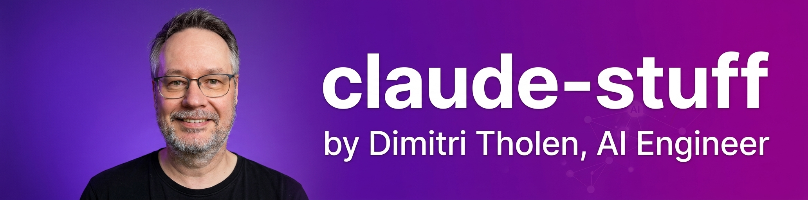
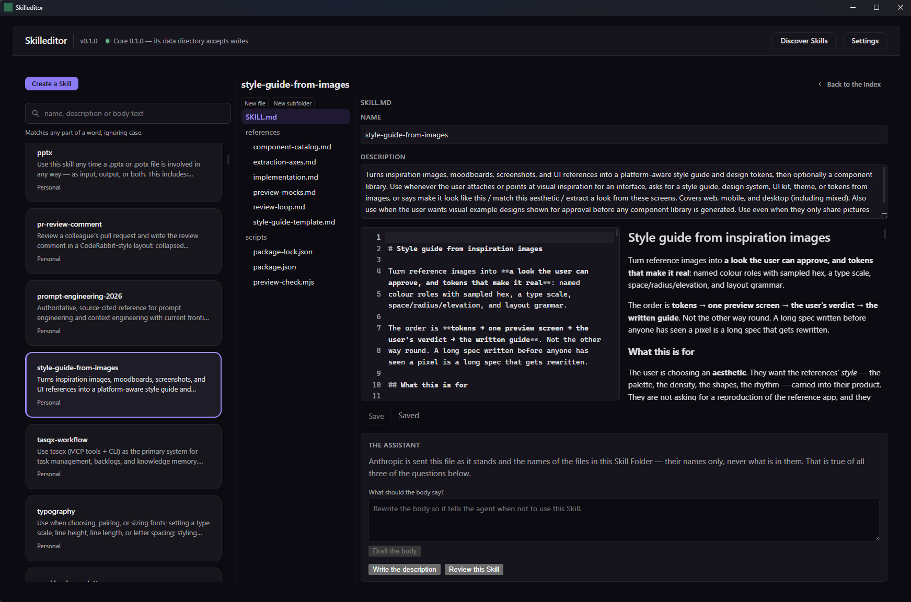

Everything I build for [Claude Code](https://claude.com/claude-code), in one place.

I'm Dimitri Tholen, AI Engineer at Blinqx AI, where I work in the Blinqx AI R&D team. Outside of that I build tooling that makes agentic coding with Claude faster and more disciplined. This repo is the index: each entry below links to its own repository with full documentation and install instructions.

## Projects

### [tasqx](https://github.com/dimitritholen/tasqx)

A terminal-native task manager with a stable JSON API. The CLI, the HTML reports, and the MCP server are all clients of one contract, so an agent and a human always see the same backlog. Claude Code talks to it over MCP: it plans work into tasks, records decisions as memory, and annotates progress as it goes, which means a session can pick up exactly where the last one stopped.

### [dstack](https://github.com/dimitritholen/dstack)

My personal Claude Code plugin: a curated set of skills wired into one development pipeline. Non-trivial work runs through `grill-with-docs` → `to-spec` → `to-tickets` → `implement` → `retro`, from stress-testing an idea to mining the session for improvements. Around the pipeline sit skills that fire on their own when the situation matches, such as `tdd`, `diagnosing-bugs`, and `domain-modeling`. The pipeline publishes its specs and tickets to tasqx, so the two projects work as a pair.

dstack builds on two upstream projects: [pstack](https://github.com/cursor/plugins/tree/main/pstack) by Cursor and [Matt Pocock's skills](https://github.com/mattpocock/skills). Full credits and adaptations are in dstack's [NOTICE.md](https://github.com/dimitritholen/dstack/blob/main/NOTICE.md).

### [skilleditor](https://github.com/dimitritholen/skilleditor) (work in progress)

A cross-platform desktop app (Tauri) for managing agent skills: it indexes the skills already on your machine, lets you edit them and author new ones with AI assistance, and discovers new ones published on GitHub. Installers for Windows, macOS, and Linux are on the [releases page](https://github.com/dimitritholen/skilleditor/releases/latest).

More of my Claude projects will land here as I clean them up for public use.
